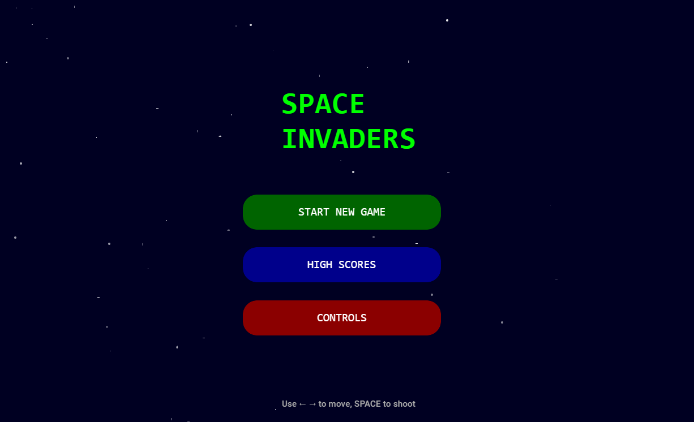
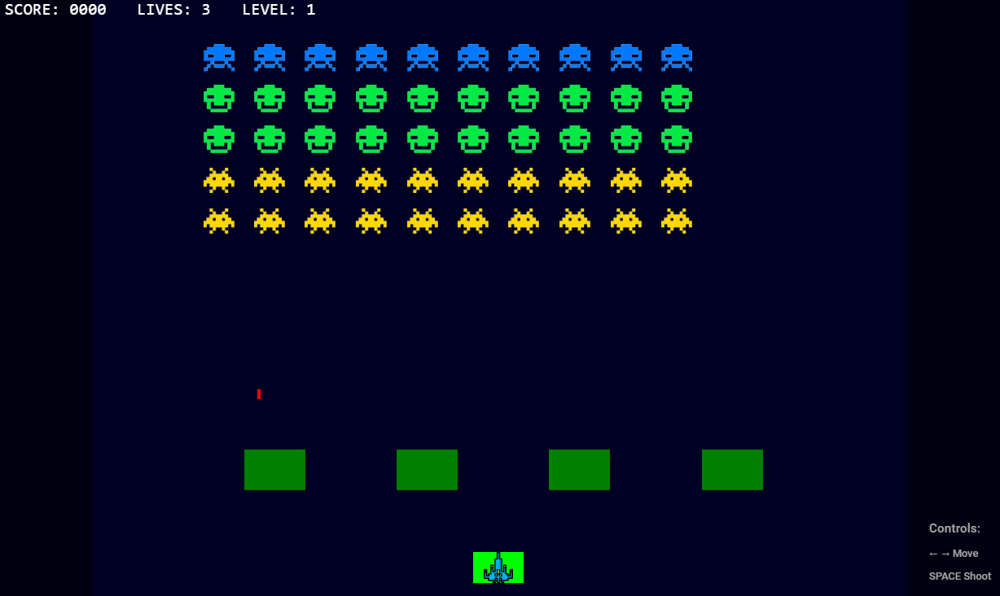
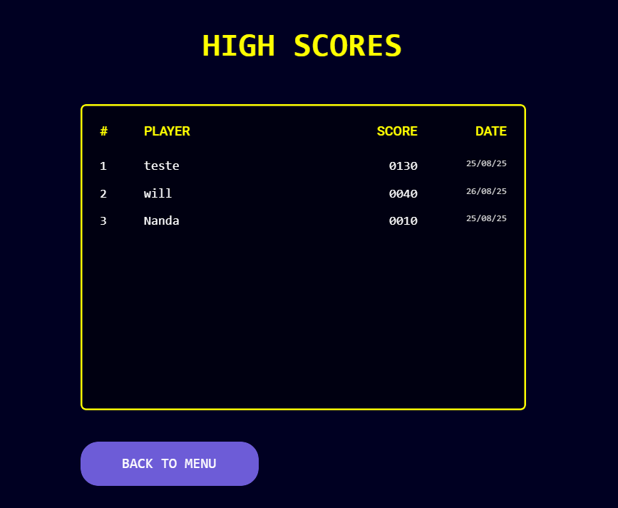
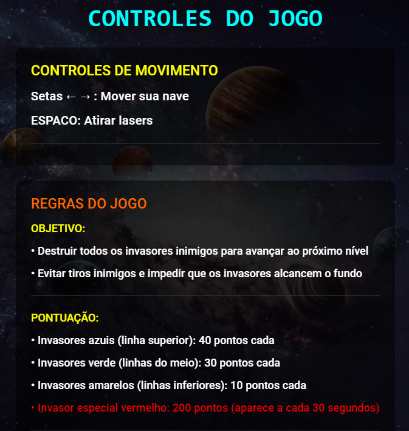

# 🚀 Space Invaders - Uno Platform

Um clone completo do clássico Space Invaders desenvolvido com **Uno Platform** e **C#**, compatível com Windows, WebAssembly, Android, iOS, macOS e Linux.

## 📋 Índice

- [Sobre o Projeto](#sobre-o-projeto)
- [Recursos do Jogo](#recursos-do-jogo)
- [Capturas de Tela](#capturas-de-tela)
- [Tecnologias Utilizadas](#tecnologias-utilizadas)
- [Pré-requisitos](#pré-requisitos)
- [Instalação e Execução](#instalação-e-execução)
- [Como Jogar](#como-jogar)
- [Arquitetura do Projeto](#arquitetura-do-projeto)
- [Estrutura de Arquivos](#estrutura-de-arquivos)
- [Recursos Técnicos](#recursos-técnicos)
- [Problemas Conhecidos e Soluções](#problemas-conhecidos-e-soluções)
- [Contribuição](#contribuição)
- [Licença](#licença)

## Sobre o Projeto

Este é um clone quase fiel do clássico jogo **Space Invaders** (1978), desenvolvido como demonstração das capacidades do Uno Platform para desenvolvimento multiplataforma. O projeto implementa todas as mecânicas clássicas do jogo original com gráficos modernos e funcionalidades adicionais.

###  Recursos do Jogo

####  Mecânicas de Gameplay
- **Movimento do jogador**: Controle suave com as setas do teclado
- **Sistema de tiro**: Projéteis limitados (um tiro por vez)
- **Inimigos em formação**: 50 invasores organizados em 5 fileiras
- **3 tipos de inimigos** com pontuações diferentes:
    - 🛸 **Pequenos (azuis)**: 30 pontos cada
    - 👽 **Médios (verdes)**: 20 pontos cada
    - 🛴 **Grandes (amarelos)**: 10 pontos cada
- **Invasor especial vermelho**: Aparece a cada 30 segundos (100 pontos)
- **Sistema de escudos**: 4 escudos destrutíveis para proteção
- **Progressão de dificuldade**: Inimigos ficam mais rápidos a cada eliminação

#### 🏆 Sistema de Pontuação
- **Pontuação acumulativa** com diferentes valores por tipo de inimigo
- **Vida extra** a cada 1000 pontos (máximo 6 vidas)
- **High scores persistentes** salvos localmente
- **Tabela de recordes** com top 10 jogadores

#### 🎵 Audio e Efeitos
- **Efeitos sonoros** para todas as ações:
    - Tiro do jogador
    - Tiro dos inimigos
    - Explosões
    - Aparição do invasor vermelho
    - Vida extra
    - Game over
- **Sistema de fallback** com beeps do sistema caso arquivos de áudio não estejam disponíveis

## 📱 Capturas de Tela

### Menu Principal



### Tela de Jogo


### Tela de Pontuação


### Tela de Controle


## 🛠 Tecnologias Utilizadas

### Framework Principal
- **[Uno Platform 5.4+](https://platform.uno/)** - Framework multiplataforma
- **.NET 8** - Runtime e bibliotecas base
- **C# 12** - Linguagem de programação

### UI e XAML
- **WinUI 3** - Framework de interface moderna
- **XAML** - Linguagem de marcação para UI
- **Material Design** - Sistema de design via Uno.Toolkit.UI.Material

### Arquitetura e Padrões
- **MVVM (Model-View-ViewModel)** - Padrão arquitetural
- **Dependency Injection** - Inversão de controle
- **Repository Pattern** - Abstração de dados
- **Command Pattern** - Encapsulamento de ações

### Gerenciamento de Estado
- **CommunityToolkit.Mvvm** - Helpers para MVVM
- **ObservableCollection** - Collections reativas
- **INotifyPropertyChanged** - Notificação de mudanças

### Persistência de Dados
- **System.Text.Json** - Serialização JSON
- **Windows.Storage** - API de armazenamento local
- **ApplicationData.LocalFolder** - Pasta de dados do app

### Audio (Experimental)
- **System.Media.SoundPlayer** - Player de áudio básico
- **System.Console.Beep** - Fallback com beeps do sistema

## Pré-requisitos

### Desenvolvimento
- **Visual Studio 2022** (17.8 ou superior) com workloads:
    - .NET Desktop Development
    - Universal Windows Platform Development
    - Mobile Development with .NET
- **Uno Platform Solution Templates** instalados
- **.NET 8 SDK** ou superior

### Plataformas de Destino
| Plataforma | Versão Mínima | Status |
|-----------|---------------|---------|
| Windows | Windows 10 v1809 | ✅ Testado |
| WebAssembly | Browsers modernos | ✅ Testado |
| Android | API 21 (Android 5.0) | ⚠️ Não testado |
| iOS | iOS 11.0+ | ⚠️ Não testado |
| macOS | macOS 10.15+ | ⚠️ Não testado |
| Linux | Ubuntu 18.04+ | ⚠️ Não testado |

##  Instalação e Execução

### 1. Clonar o Repositório
```bash
git clone https://github.com/Nanda2301/Space-Invaders-Game.git
cd SpaceInvaders-Uno
```

### 2. Restaurar Dependências
```bash
dotnet restore
```

### 3. Executar o Projeto

#### Windows (recomendado)
```bash
dotnet run --project SpaceInvaders --framework net8.0-windows10.0.19041
```

#### WebAssembly
```bash
dotnet run --project SpaceInvaders.Wasm
```

#### Outras Plataformas
Consulte a [documentação oficial do Uno Platform](https://platform.uno/docs/articles/getting-started.html).

### 4. Arquivos de Áudio (Opcional)
Para funcionalidade completa de áudio, adicione os seguintes arquivos na pasta `Assets/Sounds/`:
- `player_shoot.wav`
- `enemy_shoot.wav`
- `explosion.wav`
- `red_enemy_appear.wav`
- `red_enemy_killed.wav`
- `extra_life.wav`
- `game_over.wav`

> **Nota**: O jogo funciona sem estes arquivos usando beeps do sistema como fallback.

##  Como Jogar

### Controles Básicos
| Tecla | Ação |
|-------|------|
| `←` `→` | Mover a nave |
| `ESPAÇO` | Disparar laser |

### Objetivos
1. **Eliminar todos os invasores** para avançar de nível
2. **Evitar tiros inimigos** e não deixar que cheguem até você
3. **Usar escudos** estrategicamente para proteção
4. **Acumular pontos** para entrar no hall da fama

### Dicas Estratégicas
- **Elimine invasores laterais primeiro** para limitar o movimento do grupo
- **Use escudos como cobertura** mas lembre que eles se deterioram
- **Fique atento ao invasor vermelho** - ele vale muito mais pontos
- **Gerencie seus tiros** - só pode haver um projétil seu na tela por vez

### Sistema de Pontuação
```
Invasor Pequeno (azul):    30 pontos
Invasor Médio (verde):     20 pontos
Invasor Grande (amarelo):  10 pontos
Invasor Especial (vermelho): 100 pontos
Vida Extra: A cada 1000 pontos (máx. 6 vidas)
```

## 🏗 Arquitetura do Projeto

### Padrão MVVM
```
┌─────────────┐    ┌──────────────┐    ┌─────────────┐
│    View     │◄──►│  ViewModel   │◄──►│    Model    │
│   (XAML)    │    │   (Logic)    │    │   (Data)    │
└─────────────┘    └──────────────┘    └─────────────┘
       │                    │                   │
   UI Events           Commands            Game State
   Data Binding        Properties          Business Logic
```

### Camadas do Sistema
1. **Presentation Layer** (Views + ViewModels)
    - Interface do usuário
    - Lógica de apresentação
    - Data binding

2. **Business Layer** (Services + Models)
    - Regras de negócio
    - Lógica do jogo
    - Validações

3. **Data Layer** (Repositories + Storage)
    - Persistência de dados
    - Acesso a arquivos
    - Gerenciamento de high scores

### Fluxo de Dados
```
User Input → ViewModel → Service → Model → GameState → View Update
```

## 📁 Estrutura de Arquivos

```
SpaceInvaders/
├── 📁 Models/                    # Modelos de dados
│   ├── GameObjects/             # Entidades do jogo
│   │   ├── Player.cs           # Jogador
│   │   ├── Enemy.cs            # Inimigos
│   │   ├── Bullet.cs           # Projéteis
│   │   ├── Shield.cs           # Escudos
│   │   └── RedEnemy.cs         # Inimigo especial
│   ├── GameState.cs            # Estado global do jogo
│   ├── GameManager.cs          # Gerenciador principal
│   └── HighScore.cs            # Modelo de pontuação
├── 📁 Services/                 # Serviços de negócio
│   ├── GameService.cs          # Lógica do jogo
│   ├── SoundService.cs         # Gerenciamento de áudio
│   ├── NavigationService.cs    # Navegação entre telas
│   ├── HighScoreService.cs     # Persistência de recordes
│   └── Interfaces/             # Contratos de serviços
├── 📁 ViewModels/              # Lógica de apresentação
│   ├── MainViewModel.cs        # Menu principal
│   ├── GameViewModel.cs        # Tela de jogo
│   └── HighScoresViewModel.cs  # Recordes
├── 📁 Views/                   # Interfaces de usuário
│   ├── MainPage.xaml(.cs)      # Tela inicial
│   ├── GamePage.xaml(.cs)      # Jogo principal
│   ├── GameOverPage.xaml(.cs)  # Fim de jogo
│   ├── HighScoresPage.xaml(.cs)# Tabela de recordes
│   ├── ControlsPage.xaml(.cs)  # Instruções
│   └── Converters/             # Conversores XAML
├── 📁 Utilities/               # Utilitários
│   ├── RelayCommand.cs         # Implementação de comandos
│   └── FileHelper.cs           # Helpers para arquivos
├── 📁 Assets/                  # Recursos estáticos
│   ├── Images/                 # Sprites e imagens
│   ├── Sounds/                 # Efeitos sonoros
│   └── Fonts/                  # Fontes personalizadas
├── App.xaml(.cs)               # Configuração da aplicação
└── Platform Heads/             # Projetos específicos por plataforma
    ├── Windows/
    ├── WebAssembly/
    ├── Android/
    └── iOS/
```

## ⚙️ Recursos Técnicos

### Gerenciamento de Estado
- **GameState centralizado** com padrão Observer
- **Sincronização de UI** via data binding
- **Estados persistentes** salvos localmente

### Performance e Otimização
- **Game loop** otimizado a 60 FPS
- **Object pooling** para projéteis (planejado)
- **Renderização eficiente** com Canvas e Shapes
- **Memory management** com Dispose patterns

### Compatibilidade Multiplataforma
```csharp
#if WINDOWS
    // Código específico do Windows
    using Windows.Storage;
#elif WEBASSEMBLY
    // Código específico do WebAssembly
    using Uno.Foundation;
#elif ANDROID
    // Código específico do Android
    using AndroidX.Core.Content;
#endif
```

### Sistema de Eventos
```csharp
// Padrão Command para ações
public RelayCommand ShootCommand { get; }

// Eventos de gameplay
public event EventHandler<GameOverEventArgs> GameOver;
public event EventHandler<ScoreChangedEventArgs> ScoreChanged;
```

##  Problemas Conhecidos e Soluções

###  Problemas Identificados

#### 1. **Áudio não funciona consistentemente**
- **Causa**: Dependência NAudio não compatível com todas as plataformas
- **Solução implementada**: Sistema de fallback com `Console.Beep()`
- **Status**: ✅ Resolvido

#### 2. **Player visualmente estático**
- **Causa**: Reference incorreta ao elemento visual
- **Solução**: Usar Rectangle do XAML diretamente
- **Status**: ✅ Resolvido

#### 3. **GameOver não navega corretamente**
- **Causa**: Método `NavigateToGameOver()` não implementado
- **Solução**: Adicionar método ao NavigationService
- **Status**: ✅ Resolvido

### 🔧 Soluções de Troubleshooting

#### Problema: Jogo não inicia
```bash
# Limpar e rebuildar
dotnet clean
dotnet build
dotnet run
```

#### Problema: Áudio não funciona
1. Verificar se pasta `Assets/Sounds/` existe
2. Confirmar arquivos .wav estão presentes
3. Fallback com beeps ainda deve funcionar

#### Problema: High scores não salvam
```csharp
// Verificar permissões de escrita
var folder = ApplicationData.Current.LocalFolder;
// Logs de debug habilitados no HighScoreService
```

#### Problema: Performance baixa
- Reduzir FPS do game timer (de 60 para 30 FPS)
- Desabilitar animações complexas no menu
- Usar Release build ao invés de Debug

##  Testes

### Cenários de Teste Manual
- [ ] **Menu navegação**: Todas as telas acessíveis
- [ ] **Controles**: Movimento e tiro responsivos
- [ ] **Collision detection**: Projéteis atingem alvos
- [ ] **Score system**: Pontuação incrementa corretamente
- [ ] **Game over**: Transição e salvamento de score
- [ ] **High scores**: Persistência e ordenação
- [ ] **Audio fallback**: Beeps quando arquivos ausentes
- [ ] **Pause/Resume**: Estado preservado
- [ ] **Multiple levels**: Progressão funcional

### Testes Automatizados (Planejado)
```csharp
[Test]
public void Player_MoveLeft_ShouldUpdatePosition()
{
    var player = new Player();
    var initialX = player.Bounds.Left;

    player.MoveLeft();

    Assert.That(player.Bounds.Left, Is.LessThan(initialX));
}
```

## 📈 Roadmap de Melhorias

### Versão 1.1 (Próxima)
- [ ] **Música de fundo** em loop
- [ ] **Animações de sprites** para inimigos
- [ ] **Efeitos visuais** para explosões
- [ ] **Power-ups** especiais
- [ ] **Testes unitários** básicos

### Versão 1.2 (Futuro)
- [ ] **Multijogador local** (2 players)
- [ ] **Diferentes tipos de armas**
- [ ] **Boss fights** em níveis especiais
- [ ] **Temas visuais** alternativos
- [ ] **Conquistas/achievements**

### Versão 2.0 (Longo prazo)
- [ ] **Multijogador online**
- [ ] **Level editor** personalizado
- [ ] **Leaderboards globais**
- [ ] **VR support** (HoloLens)
- [ ] **AI opponents**

## 🤝 Contribuição

### Como Contribuir
1. **Fork** o repositório
2. **Clone** sua fork localmente
3. **Crie uma branch** para sua feature (`git checkout -b feature/AmazingFeature`)
4. **Commit** suas mudanças (`git commit -m 'Add some AmazingFeature'`)
5. **Push** para a branch (`git push origin feature/AmazingFeature`)
6. **Abra um Pull Request**

### Diretrizes de Contribuição
- **Siga os padrões** de código existentes
- **Documente** novas funcionalidades
- **Teste** em pelo menos Windows e WebAssembly
- **Mantenha compatibilidade** com todas as plataformas Uno

### Áreas que Precisam de Ajuda
- 🎵 **Sistema de áudio** mais robusto
- 🎨 **Assets visuais** (sprites, backgrounds)
- 🏃 **Otimizações de performance**
- 🧪 **Testes automatizados**
- 📱 **Testes em dispositivos móveis**

## 📄 Licença

Este projeto está licenciado sob a **MIT License** - veja o arquivo [LICENSE](LICENSE) para detalhes.

```
Copyright (c) 2024 Space Invaders Uno

Permission is hereby granted, free of charge, to any person obtaining a copy
of this software and associated documentation files (the "Software"), to deal
in the Software without restriction, including without limitation the rights
to use, copy, modify, merge, publish, distribute, sublicense, and/or sell
copies of the Software, and to permit persons to whom the Software is
furnished to do so, subject to the following conditions:

The above copyright notice and this permission notice shall be included in all
copies or substantial portions of the Software.
```

<div align="center">

**Feito com ❤️ usando Uno Platform**

[⭐ Star este projeto](https://github.com/Nanda2301/Space-Invaders-Game.git) | [📝 Report Bug](https://github.com/Nanda2301/Space-Invaders-Game.git) | [💡 Request Feature](https://github.com/Nanda2301/Space-Invaders-Game.git)

</div>
